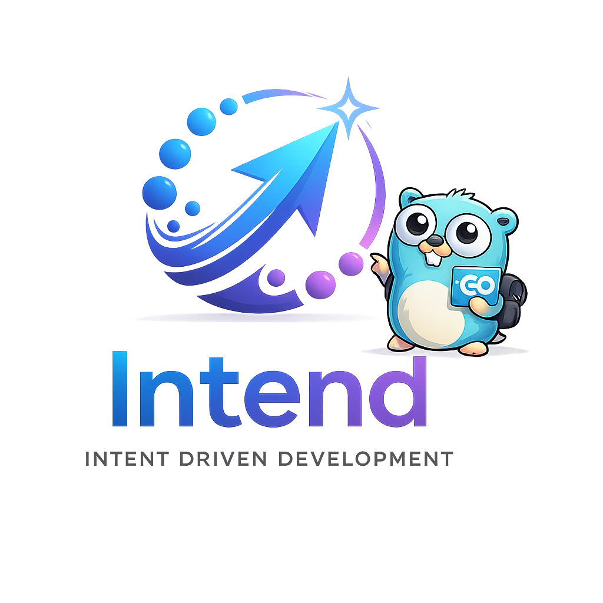

# intend

<p align="center">
  
</p>

[](https://github.com/drpaneas/intend/actions/workflows/ci.yml)
[](https://github.com/drpaneas/intend/actions/workflows/docs.yml)
[](https://github.com/drpaneas/intend/releases)
[](LICENSE)

> Code generation got cheap. Correctness did not.

`intend` is a CLI for Intent-Driven Development in Go projects.

It gives each change a name, a contract, and a locked baseline before implementation starts. Instead of discovering the real requirements by staring at a diff after the fact, you define what the change means up front and keep that contract in normal files.

The idea is simple and a little opinionated:

- humans decide what "correct" means
- the repository records that intent in plain files
- AI and code generation can move fast inside those boundaries

That makes `intend` a good fit for teams that want the speed of modern code generation without letting correctness turn into guesswork.

Each change bundle lives in the repository:

- `specs/` for intent
- `features/` for behavior
- `.intend/trace/` for tracked bundle metadata
- `.intend/locks/` for the approved baseline

No hidden database. No editor-only magic. Just a sharper workflow for building Go software when "looks plausible" is not good enough.

```bash
go build ./cmd/intend
go run ./cmd/intend init
go run ./cmd/intend new <name>
go run ./cmd/intend lock <name>
go run ./cmd/intend trace <name>
go run ./cmd/intend amend <name>
go run ./cmd/intend verify
```

Docs: [site](https://drpaneas.github.io/intend/) | [source](docs/)
Contributing: [CONTRIBUTING.md](CONTRIBUTING.md)
